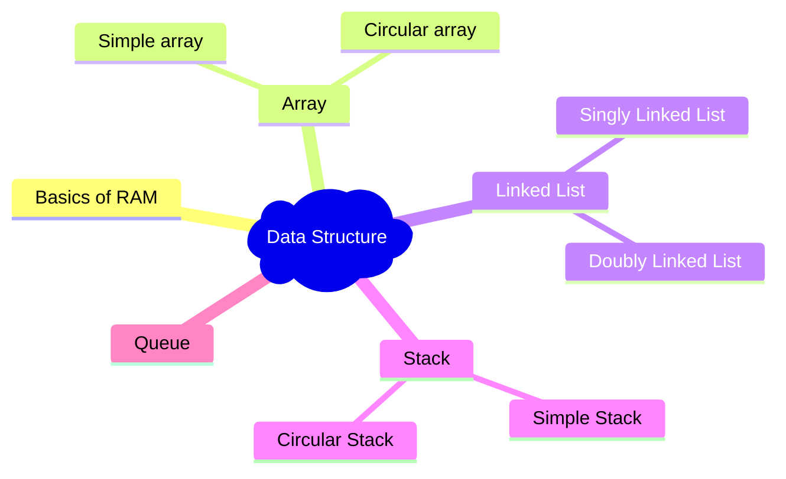

> - This section outlines my goals for 2023 and the progress I've made towards achieving them.
> - Dedicated to achieving my goals through continuous effort. Progress updates will be provided regularly.

|   | Goal | Source | Progress |
|---|---|---|---|
| 1 | Data Structures | [link](https://cloudnativebasecamp.com/) | 50% |
| 2 | Algorithms | [link](https://cloudnativebasecamp.com/) | 10% |
| 3 | Object-Oriented Programming (OOP) Principles | N/A | 0% |

--- 
## Data Structures aspects I have delved into:

